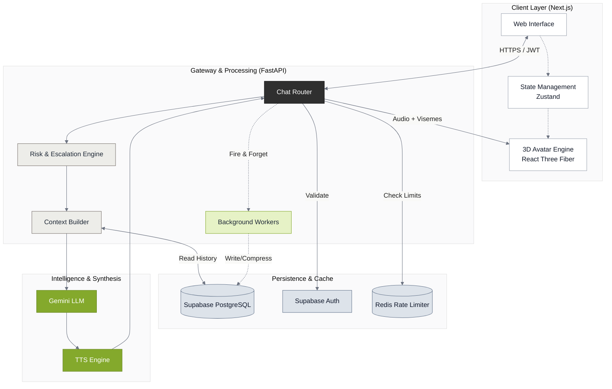

# 🏛️ System Overview (LibreMind)

## 1. High-Level Architecture

## 2. Core Philosophy

LibreMind operates on a decoupled architecture, separating the **Experience Layer** (Frontend 3D Avatar and UI) from the **Intelligence Layer** (Python-based AI, Memory, and Risk processing). State and data are orchestrated securely through **Supabase**.

This design enables asynchronous scalability, non-blocking real-time voice synthesis, and strict isolation of sensitive conversational data.

## 3. Technology Stack

* **Frontend (Experience Layer):** Next.js (App Router), React Three Fiber (3D WebGL), Zustand (State), TailwindCSS.
* **Backend (Intelligence Layer):** FastAPI (Python), Asyncio.
* **Infrastructure:** Supabase (PostgreSQL, Auth, Edge Functions), Redis (Rate Limiting).
* **AI Services:** Google Gemini (Reasoning), Custom TTS Engine (Voice + Viseme generation).

## 4. The Message Pipeline

Every incoming message follows a strict, asynchronous lifecycle ensuring safety and speed (timeout protected at 20s):

1.  **Ingress & Validation:** Request hits `/chat`. Checked against Redis rate limits (Per-user & Global RPM).
2.  **Security Gate:** Supabase Auth JWT and strict session ownership are verified.
3.  **Risk Engine:** Message is scanned. If high-risk, execution halts, a canned TTS response is generated, and a `safety_event` is logged.
4.  **Memory Retrieval:** `context_builder.py` reconstructs state by querying Supabase for long-term session summaries and short-term message history.
5.  **Synthesis:** Gemini generates text; TTS engine generates base64 audio and lip-sync visemes.
6.  **Background Processing:** Main thread returns data to the client immediately. Async workers (`summarizer_worker.py`) take over to save messages, update titles, and compress memory.

## 5. Memory Architecture (Sliding Compression)

To bypass LLM context limits and control API costs, LibreMind uses a two-tier database memory model:

* **Short-Term Memory (`messages` table):** Maintains the raw, exact text of the most recent interactions (~8-10 messages).
* **Long-Term Memory (`conversation_summaries` table):** When a session crosses a defined threshold (e.g., 25 messages), an async worker condenses the oldest raw messages into a permanent summary paragraph and deletes the old raw rows.

## 6. Safety & Concurrency

* **Async-Safe:** All blocking operations (Supabase calls, LLM requests, TTS generation) are wrapped in `asyncio.to_thread()`, ensuring the FastAPI event loop is never blocked.
* **Multi-tenant Isolation:** Context building inherently requires strict session ID and User ID matching, preventing cross-tenant data leaks even in the event of API routing errors.