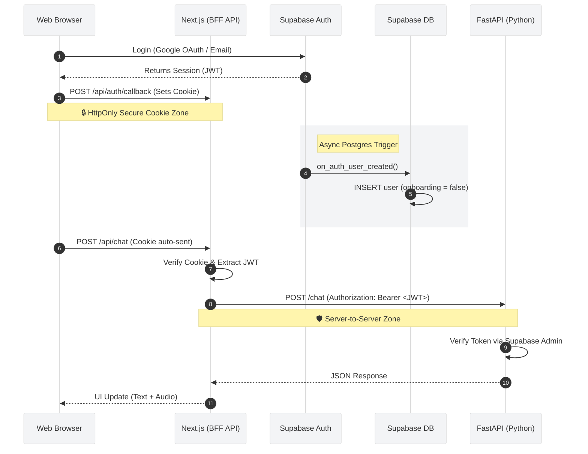

# 🔐 Authentication & Request Flow (LibreMind)

## 1. End-to-End Security Pipeline

## 2. The BFF (Backend-for-Frontend) Security Model

LibreMind employs a **Backend-for-Frontend (BFF)** security pattern to protect credentials and API routes.

* **Client to Next.js:** The browser **never** handles raw JWTs in local storage. Sessions are managed exclusively via `HttpOnly`, `Secure`, `SameSite=Lax` cookies. This prevents Cross-Site Scripting (XSS) attacks from stealing tokens.
* **Next.js to FastAPI:** The Next.js API routes act as a secure proxy. They intercept the cookie, extract the underlying JWT, and forward it to the Python backend using standard `Authorization: Bearer <token>` headers.
* **FastAPI Validation:** The Python backend trusts no one. It independently verifies the Bearer token against the Supabase project configuration before executing any logic.

## 3. Account Provisioning & Onboarding

User creation relies on PostgreSQL database triggers to ensure data consistency between the Auth schema and the Public schema.

1. **Trigger:** When a user signs up, Supabase Auth fires `on_auth_user_created()`.
2. **Profile Creation:** A corresponding row is inserted into the `public.users` table with the flag `onboarding: false`.
3. **Routing:** If a user attempts to access `/dashboard` with `onboarding: false`, Next.js middleware forcefully redirects them to `/onboarding`.
4. **Completion:** Submitting the onboarding form updates the DB to `onboarding: true` and grants access to the main application.

## 4. Authentication Edge Cases

### The OAuth to Password Bridge
If a user originally creates an account using **Google OAuth** but later wishes to log in using an **Email/Password** combination, they cannot simply "log in" because no password exists.

**Required Flow:**
1. User attempts Email/Password login -> *Fails (Invalid Credentials)*.
2. User clicks **"Forgot Password"**.
3. Supabase issues a `resetPasswordForEmail()` link to their Google email.
4. User clicks the link, establishing a temporary secure session.
5. User sets a new password via `updateUser({ password: "new" })`.
6. **Result:** The user account is now bridged. They can log in via Google OR Email/Password.