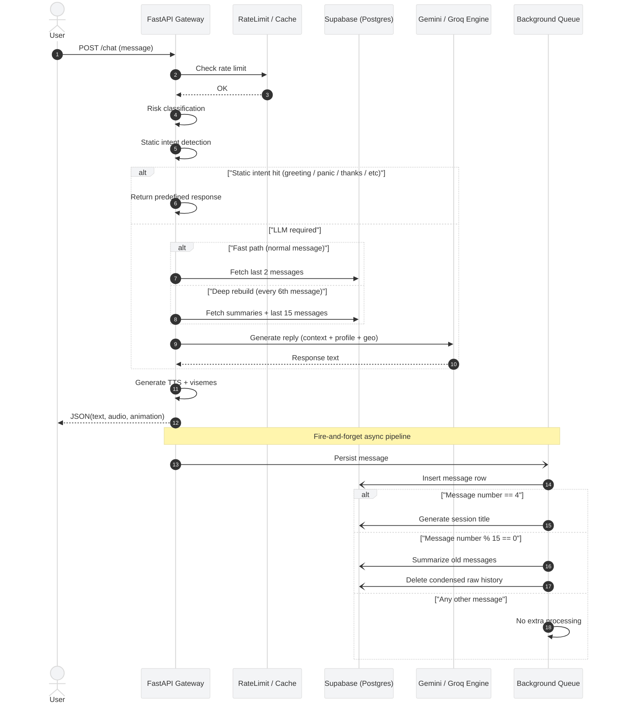

# 🧠 Message Pipeline & Lifecycle (LibreMind)

## 1. Chat Processing Architecture

## 2. Quick Reference: Triggers & Lifecycle

| Component | Trigger / Condition | Primary Action | Local Mode |
| :--- | :--- | :--- | :--- |
| **Request Gauntlet** | Every message | Rate limits, Risk assessment | Skips DB validation |
| **Static Intents** | Regex match (Hi, Bye, Panic) | Returns hardcoded text (Zero API cost) | Active |
| **Context Builder** | Every 6th message | Fetches DB summaries + last 15 msgs | Skips DB, uses raw |
| **Auto-Titling** | Exactly on 4th msg | Generates 2-4 word title for UI | Skipped |
| **Memory Compressor**| Every 15th msg | Summarizes old msgs, deletes raw | Skipped |

---

## 3. The Request Gauntlet (`POST /chat`)
*Executes immediately to protect resources and ensure safety.*

* **Rate Limits:** Per-user (15 msgs/30 mins) and Global RPM (15/min) constraints to protect API limits.
* **Risk Assessment:** Scans for high/medium risk keywords. If triggered, skips all LLM logic, returns a canned safety response, and logs to `safety_events`.
* **Session Validation:** Ensures the session ID belongs to the authenticated user.

## 4. Zero-Cost Intent Interception (Quota Saver)
*A regex-based interception layer that prevents wasting LLM tokens on simple or repetitive inputs.*

Before calling the Gemini API, the system scans the user's message against a predefined set of intents:
* **App Triggers:** Catches specific UI-driven states (e.g., Panic attacks, Venting, Dissociation, Boredom) and returns immediate, hardcoded grounding instructions.
* **Conversational Fillers:** Catches simple greetings ("Hi", "Hello"), goodbyes, affirmations ("Ok", "Thanks"), and basic check-ins ("How are you?", "Who are you?", "I am fine").
* **Bilingual Support:** Understands both English and Hinglish inputs (e.g., "kaise ho", "thak gaya").
* **Safety Exclusion:** Uses negative lookaheads to ensure it doesn't accidentally trigger if the user is telling a story (e.g., "he was angry" will bypass the filter and go to the LLM, whereas "I am angry" triggers the hardcoded Vent response).

## 5. Dynamic Context & Generation
*Optimizes token usage and handles API unreliability.*

* **Context Building:** Uses a "Fast Path" (last 2 messages) for standard chat, and a "Deep Build" (Summaries + 15 messages) every 6th turn.
* **Culturally Aware Prompting:** Dynamically injects the user's local helplines (e.g., Mumbai vs. Global) and language preferences (English vs. Hinglish) into the system prompt.
* **The Cascade Fallback:** 1. Attempts `gemini-2.5-flash`.
  2. If Quota/Resource Exhausted, falls back to `gemini-3-flash-preview`.
  3. If all Gemini models fail or block the request via safety settings, it automatically reroutes the prompt to the **Groq LLM** as a final failsafe.
* **Text Sanitization:** Strips markdown, fixes hanging sentences, and ensures clean text for the TTS engine.

## 6. Background Workers (Async)
*Fires asynchronously after response delivery.*

* **Message #4:** Generates a short, private session title.
* **Message #15 (Compression):** The memory engine summarizes older messages, keeps the 8 most recent for immediate context, and hard-deletes the rest to save database storage.

## 7. Post-Session Analysis (`POST /end`)
*Runs strictly once per session when terminated.*

* Generates a 1-sentence analytical summary, 3-5 clinical tags, and a final risk assessment. If high risk is detected, it flags the session with `⚠️ Crisis Alert` for review.