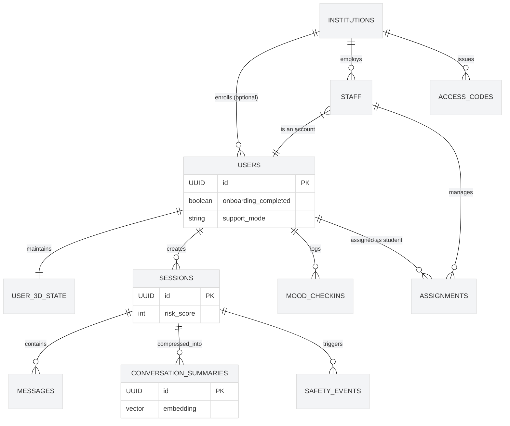

# 🗄️ Database & Data Models (LibreMind)

## 1. Entity Relationship Diagram

## 2. Core Domains & Tables

The LibreMind database is built on PostgreSQL (via Supabase) and utilizes the `pgvector` extension for AI memory retrieval.

### A. Identity & Experience
* **`users`**: The central user record, linked 1:1 with `auth.users` via a database trigger (`on_auth_user_created`). Stores onboarding state, profile JSON, and support mode (`self` vs `institutional`).
* **`user_3d_state`**: A dedicated table linked 1:1 with `users`. Prevents UI crashes by permanently storing the user's customized avatar configuration, 3D environment selection, and camera settings.

### B. Therapy & Institutional Management (Multi-Tenant)
* **`institutions`**: Represents schools, colleges, or private practices. Determines billing tiers and manages global access.
* **`access_codes`**: Secure, role-based invite codes (e.g., `START-THERAPY-2026`) used to automatically provision therapist/staff accounts upon signup.
* **`staff`**: Links a user account to an `institution` with a specific role (`admin`, `therapist`).
* **`assignments`**: The critical junction table linking a Student (`users`) to a Therapist (`staff`). Handles pending email invitations and active caseloads.

### C. The AI Memory Engine
* **`sessions`**: Represents a continuous chat thread. Tracks start/end times and cumulative risk scores.
* **`messages`**: The short-term memory layer. Stores raw text and sender info (`user` vs `ai`).
* **`conversation_summaries`**: The long-term memory layer. Stores compressed AI summaries of old messages, extracted topic tags, and a **1536-dimensional Vector Embedding** for semantic RAG (Retrieval-Augmented Generation) searches.

### D. Wellness & Safety
* **`mood_checkins`**: Daily emotional tracking with intensity scores.
* **`quotes`**: A static repository of categorized therapeutic quotes (e.g., anxious, burnout, sad).
* **`safety_events`**: An immutable audit log of high-risk occurrences (e.g., suicidal ideation detected by the LLM), linked to the specific session for therapist review.

## 3. Data Privacy & Security (RLS)

LibreMind employs strict **Row Level Security (RLS)** directly at the database layer to ensure patient confidentiality. 

### The `check_relation()` Gatekeeper
A custom PL/pgSQL function validates access dynamically. A user can only access a profile or session if:
1. They are the owner (`auth.uid() = id`).
2. They are an active Therapist assigned to that specific Student via the `assignments` table.

### Key RLS Policies
* **Therapist Isolation:** Therapists can only view profiles, sessions, and mood check-ins of students who have explicitly accepted their `assignment` invite (`status = 'active'`). 
* **Self-Healing Invites:** Students can query the `assignments` table using their authenticated email to find and accept pending therapy invitations.
* **Immutable History:** Safety events and messages cannot be altered or deleted by users once inserted.

## 4. Automation & Triggers

* **Automatic Provisioning:** When a user registers via Google/Email, the `on_auth_user_created` trigger automatically provisions their row in the `users` table and creates a default `user_3d_state` record, guaranteeing the frontend never encounters null state errors.
* **Invite Redemption:** The `redeem_invite_code(code, uid)` RPC securely validates usage limits and expiration dates before elevating a standard user to a `staff` role.