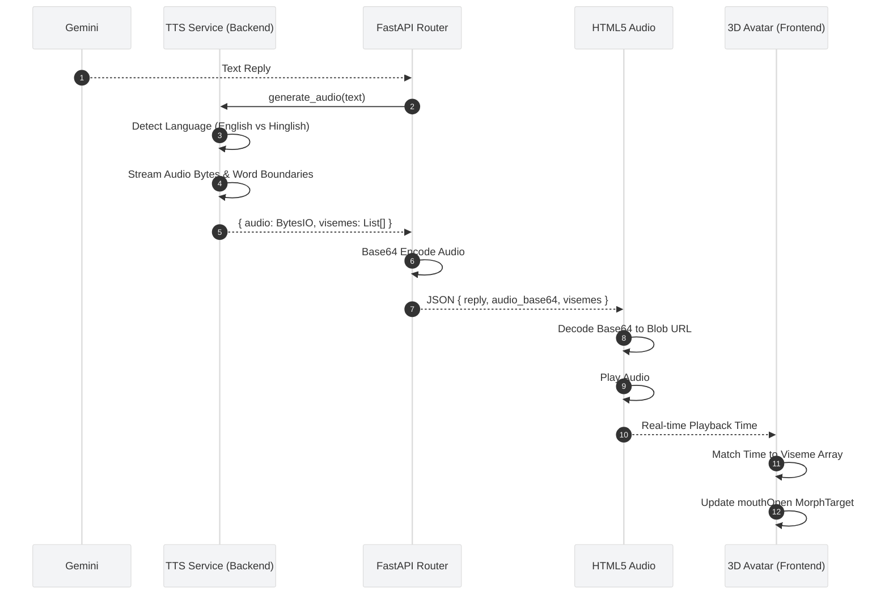

# 👄 Lip-Sync & Audio Generation (LibreMind)

## 1. End-to-End Audio Pipeline




## 2. The TTS Engine (`tts_service.py`)

LibreMind utilizes `edge-tts` to generate high-fidelity neural voices with minimal latency. Crucially, it extracts both the audio stream and the **WordBoundary** metadata required for accurate 3D lip-syncing.

### A. Dynamic Language Detection
Because LibreMind supports Hinglish (Hindi written in the Roman alphabet), standard TTS engines often mispronounce the text if forced into an English voice model. The TTS Service intercepts the text and scans for a hardcoded list of `strong_tokens` (e.g., *mujhe, udaas, pareshan, zindagi*). 

* **English Text:** Routes to `en-US-AvaNeural`.
* **Hinglish Text:** Routes to `hi-IN-SwaraNeural`.
* **Hindi Text (Devanagari):** Routes to `hi-IN-SwaraNeural`.

### B. Streaming & Data Extraction
The engine streams the response in chunks. It listens for two distinct event types:
1.  **`audio` chunks:** The raw audio bytes, accumulated in an `io.BytesIO` buffer.
2.  **`WordBoundary` chunks:** The timing metadata. Every time the engine generates a word, it yields the `offset` (start time), `duration`, and the `text` of the word. This is appended to the `visemes` array.

## 3. The API Contract

The backend `/chat` endpoint base64 encodes the `BytesIO` buffer and returns it alongside the viseme array and the original text.

**Response Structure:**
```json
{
  "text": "Take a deep breath. I am right here with you.",
  "audio": "SUQzBAAAAAAAI1RTU0UAAAAPAAADTGF...", // Base64 String
  "visemes": [
    { "offset": 100000, "duration": 3500000, "text": "Take" },
    { "offset": 3600000, "duration": 1000000, "text": "a" },
    { "offset": 4600000, "duration": 4000000, "text": "deep" }
  ],
  "animation": "Talking"
}
```
*(Note: Edge-TTS offsets and durations are measured in 100-nanosecond units).*

## 4. Frontend Execution (Next.js & Three.js)

### A. Audio Decoding
When the frontend receives the JSON payload, it extracts the `audio_base64` string, decodes it into a binary `Blob`, and creates a temporary `URL.createObjectURL(blob)`. This URL is loaded into a hidden `<audio>` element.

### B. Viseme Synchronization
The 3D Avatar component (built with React Three Fiber) is responsible for the actual animation. 
1.  **The Hook:** A custom hook (e.g., `useLipsync`) monitors the `currentTime` of the HTML5 `<audio>` element during playback.
2.  **The Mapping:** The hook compares the current playback time against the `offset` and `duration` values in the `visemes` array.
3.  **The Morph Targets:** When the playback time falls within a word's duration, the hook triggers the Avatar's facial morph targets (e.g., setting the `mouthOpen` influence to `1.0`). When the word ends, the morph target returns to `0.0`.

## 5. Failsafes & Fallbacks

* **Empty Input:** If the text is empty, the service immediately throws a handled exception rather than calling the external API.
* **Stream Failure:** If the TTS stream fails or returns 0 bytes, the backend logs the error and gracefully returns the JSON with `audio: null`. The frontend chat continues seamlessly without voice.
* **Missing Visemes:** Occasionally, the TTS engine returns audio but fails to yield `WordBoundary` events. In this scenario, the backend calculates a `fallback_duration` based on character count and injects a single, continuous "dummy" viseme so the avatar's mouth still moves for the duration of the audio.