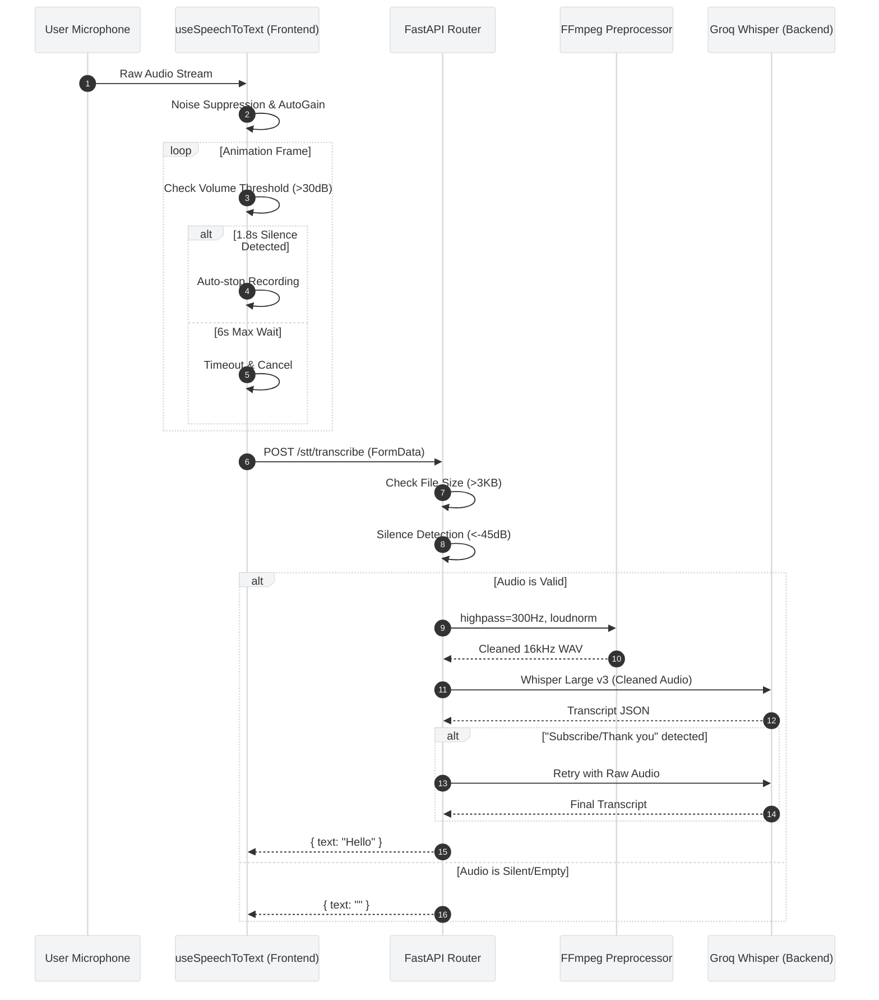

# 🎙️ Speech-to-Text & Audio Input Pipeline (LibreMind)

## 1. The Audio Recording Flow



## 2. Frontend Capture (`useSpeechToText.ts`)

The frontend relies on the native `MediaRecorder` API combined with the Web Audio API (`AudioContext`) to capture and analyze voice data in real-time.

### A. Environment Tuning & Constraints
To handle noisy environments (e.g., traffic in Mumbai), the initial media stream is requested with built-in browser constraints:
```javascript
navigator.mediaDevices.getUserMedia({ audio: {
    noiseSuppression: true,
    echoCancellation: true,
    autoGainControl: true
}});
```

### B. Smart Auto-Stop (Silence Detection)
Instead of forcing the user to manually click "Stop," an `AnalyserNode` constantly monitors the microphone's input volume:
1.  **Threshold:** The volume must exceed `SILENCE_THRESHOLD (30)` to register as speech.
2.  **Auto-Stop:** If the user speaks, but then pauses for `1800ms` (1.8s), the recorder automatically stops and sends the audio to the backend. This keeps the conversational cadence fast.
3.  **Timeout:** If the user clicks the mic but never speaks, the recording automatically cancels after `6000ms` (6s) to prevent hanging UI states.

## 3. Backend Processing (`stt_service.py`)

The backend utilizes **Groq's Whisper Large V3** model for ultra-fast, high-accuracy transcription. However, to prevent wasted API quotas on empty audio or static, the system employs multiple layers of defense.

### A. The Three-Tier Defense System
Before the audio ever reaches the Groq API, it must pass:
1.  **Size Check:** Files smaller than `3000 bytes` are instantly rejected.
2.  **Hard Silence Check:** The backend analyzes the raw PCM frames using the `audioop` library. If the Root Mean Square (RMS) volume is below `-45dB` (standard background room noise), the request is aborted.
3.  **FFmpeg Preprocessing:** If the audio passes, it is routed through a strict FFmpeg pipeline:
    * `highpass=f=300`: Aggressively cuts low frequencies (AC hum, distant traffic).
    * `loudnorm=I=-14:TP=-0.5:LRA=11`: Normalizes and boosts the remaining vocal frequencies to a standard broadcast volume.

### B. The Whisper Hallucination Fallback
A known quirk of Whisper models is that when fed pure static or highly distorted audio, they often "hallucinate" training data phrases like *"Thank you for watching"*, *"Subscribe"*, or *"Amara.org"*.

To counter this:
1.  The backend scans the returned transcript against a `BAD_PHRASES` list.
2.  If a hallucination is detected, it assumes the aggressive FFmpeg filtering distorted the audio too much.
3.  It immediately **retries the API call** using the original, unprocessed raw audio.

## 4. Chat Integration (`ChatControlBar.tsx`)

The STT pipeline seamlessly integrates into the main chat flow:
1.  User clicks the mic icon.
2.  `useSpeechToText` captures the audio and returns the text transcript.
3.  The control bar populates the input field.
4.  The `handleSubmit` function is immediately triggered, stopping the avatar's current animation and sending the text to the `useChat` LLM pipeline.