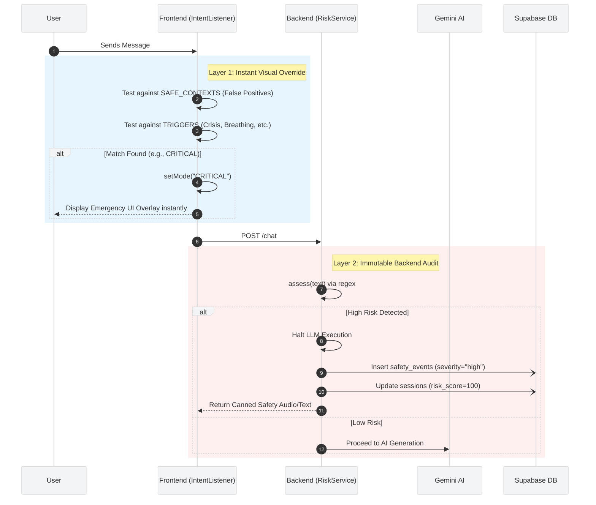

# 🛡️ Risk & Escalation Engine (LibreMind)

## 1. Dual-Layer Safety Architecture

LibreMind employs a two-tier safety system to ensure zero latency on critical interventions while maintaining a secure, tamper-proof audit log on the backend.

## 2. Layer 1: Frontend Intent Listener

The `<IntentListener />` runs silently in the client browser, scanning the active chat history. Its primary job is **speed**—instantly swapping the UI to a specific therapeutic or emergency mode before the backend even finishes processing the audio.

### A. Safety Valves (False Positive Prevention)
To prevent the app from triggering an emergency screen when a user is simply recounting a movie or speaking in the past tense, it first tests against `SAFE_CONTEXTS`:
* **Third Person / Storytelling:** Matches `he`, `she`, `movie`, `lyrics`. (e.g., *"He was so angry he wanted to end it all"* -> Ignored).
* **Past Tense:** Matches `yesterday`, `used to`, `felt like`.
* **Explicit Risk Override:** If a highly specific phrase (like *"kill myself"*) is detected, it pierces through the safety valve anyway, assuming immediate danger.

### B. Trigger Modes (`useSessionStore`)
If the message passes the safety valves, it maps to an `AppMode`:
* **`CRITICAL` / `EMERGENCY`:** Immediate suicidal ideation or intent. Swaps the UI to display crisis helplines.
* **`BREATHING`:** Matches "panic attack", "can't breathe". Swaps to the visual breathing exercise.
* **`VENT`:** Matches severe anger. Swaps to the "Vent Box" shredding activity.
* **`GROUNDING` / `REFLEX`:** Matches dissociation or low energy.

## 3. Layer 2: Backend Risk Service

While the frontend changes the UI, the backend `RiskService` acts as the un-bypassable security gate. It scans the raw payload text using compiled regex patterns for both English and Hinglish (e.g., *mujhe marne ka man*, *zindagi khatam*).

### A. The Assessment Flow
1.  **Risk Assessment:** The `assess(text)` function categorizes the input as `low`, `medium`, or `high`.
2.  **Escalation Plan:** * **High Risk (Self-harm, Suicide):** `EscalationPlan` halts the LLM pipeline and returns a fixed, clinical `SAFETY_RESPONSE` instructing the user to seek immediate help.
    * **Medium Risk (Hate speech, Hacking):** Returns a `BOUNDARY_RESPONSE` to politely shut down the interaction.
    * **Low Risk:** Allows the prompt to pass to the LLM.

### B. Immutable Logging (`save_escalation`)
If a `high` risk event is triggered, an asynchronous background task fires:
1.  Inserts a record into the `safety_events` table (Severity: `high`, Detected By: `risk_service`).
2.  Updates the `sessions` table, setting the `risk_score` to `100`.
3.  This permanently flags the session for the assigned Therapist to review on their dashboard.