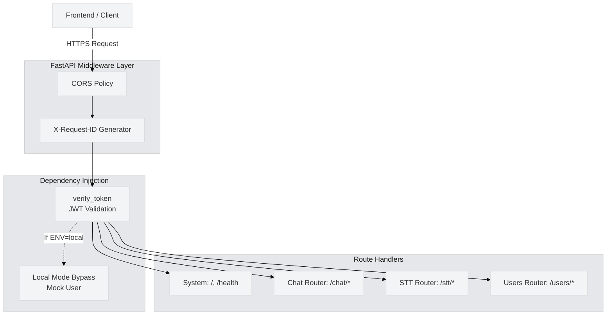

# 🌐 API Endpoints & Gateway Configuration


## 1. API Gateway Architecture



## 2. Global Server Configuration

The FastAPI application acts as the central orchestrator (`main.py`).

* **Lifespan Management:** On startup, the server preloads and warms up the STT Whisper model to prevent "cold start" latency on the first user request.
* **CORS Policy:** Strictly limited to `http://localhost:3000`, `https://libremind.in`, and `https://www.libremind.in`.
* **Traceability:** A custom middleware injects a unique UUID into the `X-Request-ID` header of every response for easier log tracing and debugging.
* **API Documentation:** Swagger UI (`/docs`, `/redoc`) is automatically disabled in production to prevent unauthorized endpoint discovery.

## 3. Local Development Overrides

To streamline local UI development without needing a live Supabase database or active JWT tokens, the server detects if `ENV == "local"` and applies a dependency override:

```python
# Replaces verify_token with a hardcoded mock user payload
async def mock_verify_token():
    return {
        "sub": "local_dev_user_123", 
        "email": "dev@libremind.local",
        "aud": "authenticated"
    }
app.dependency_overrides[verify_token] = mock_verify_token
```
*This ensures frontend developers can test the chat API locally without fighting authentication barriers.*

## 4. Endpoint Reference

*Note: All functional endpoints (except system routes) require a valid Supabase JWT Bearer token in the `Authorization` header.*

### System Routes
| Method | Endpoint | Description | Auth Required |
| :--- | :--- | :--- | :---: |
| `GET` | `/` | Root verification check | ❌ |
| `GET` | `/health` | Server health and uptime status | ❌ |

### Chat Router (`/chat`)
| Method | Endpoint | Payload | Description |
| :--- | :--- | :--- | :--- |
| `POST` | `/chat/chat` | `{ message, session_id, user_location }` | Core LLM generation. Returns text, Base64 audio, and visemes. |
| `POST` | `/chat/end` | `{ session_id, is_crisis }` | Terminates a session and triggers async DB summarization. |

### Speech-to-Text Router (`/stt`)
| Method | Endpoint | Payload (FormData) | Description |
| :--- | :--- | :--- | :--- |
| `POST` | `/stt/transcribe` | `audio` (File), `username` | Processes raw audio via FFmpeg and Groq Whisper. Returns transcript text. |

### Users Router (`/users`)
| Method | Endpoint | Payload | Description |
| :--- | :--- | :--- | :--- |
| `*` | `/users/*` | *Varies* | Manages user-specific backend operations (Delegated to user_router). |