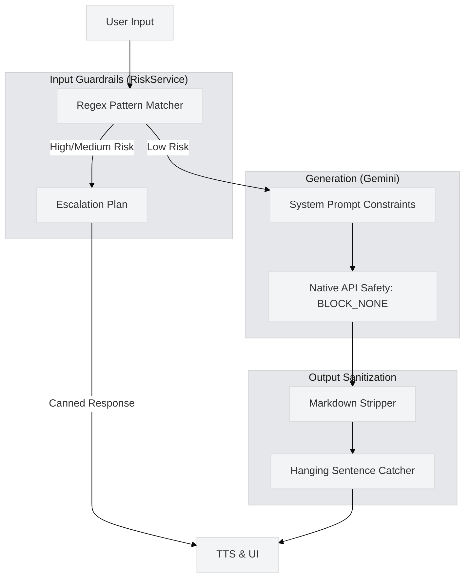

# 🛡️ AI Guardrails & Prompt Safety (LibreMind)


## 1. Safety Pipeline Architecture



## 2. Input Guardrails (The Pre-Flight Check)
Before the LLM even sees the user's message, `RiskService` analyzes the text against strict compiled regex patterns to prevent prompt injection and handle crises immediately.

* **High Risk (Hard Stop):** Matches direct, first-person suicidal intent, specific self-harm methods (tailored for local contexts, e.g., *drink pesticide*, *zeher kha*), and severe crimes. Bypasses the LLM entirely and returns `SAFETY_RESPONSE`.
* **Medium Risk (Boundary Setting):** Matches abusive language, deep frustration (*bakwas*, *idiot*), and hacking/jailbreak attempts (*bypass*, *exploit*). Bypasses the LLM and returns `BOUNDARY_RESPONSE`.
* **Static Intents (Cost/Safety Hybrid):** Intercepts specific UI triggers (e.g., *panic attack*, *dizzy*) and returns hardcoded grounding exercises to ensure zero-latency clinical responses.

## 3. Native API Safety Configuration
**Crucial Architecture Decision:** LibreMind overrides Gemini's default safety thresholds to `BLOCK_NONE`.

```python
safety_settings = [
    {"category": "HARM_CATEGORY_HARASSMENT", "threshold": "BLOCK_NONE"},
    {"category": "HARM_CATEGORY_HATE_SPEECH", "threshold": "BLOCK_NONE"},
    {"category": "HARM_CATEGORY_SEXUALLY_EXPLICIT", "threshold": "BLOCK_NONE"},
    {"category": "HARM_CATEGORY_DANGEROUS_CONTENT", "threshold": "BLOCK_NONE"},
]
```
* **Why?** Mental health conversations inherently trigger false positives in standard LLM safety filters (e.g., discussing depression, trauma, or passive death wishes). 
* **The Mitigation:** Because `RiskService` has already caught and deflected immediate physical dangers (High Risk), the system trusts the LLM to handle the remaining "gray area" emotional venting with empathy rather than returning a sterile, jarring API block error.

## 4. System Prompt Constraints
The system prompt tightly bounds the AI's persona and output structure.

* **Clinical Boundaries:** Instructed to act as a "calm, emotionally supportive mental health companion" (not a licensed doctor).
* **Information Asymmetry:** The prompt is injected with the user's `Baseline State` (e.g., *Feeling low*), but strictly instructed **not** to mention this explicitly unless the user brings it up, preventing the AI from sounding creepy or overly omniscient.
* **Localization Guardrails:** Dynamically swaps emergency helplines based on the user's detected location (e.g., BMC Mumbai Helplines vs. National Tele-MANAS).
* **Formatting Limits:** Commanded to write in "plain text only" (No Markdown, No lists) because the output is piped directly into a TTS engine.

## 5. Output Sanitization (Post-LLM)
Even with strict prompt instructions, LLMs can hallucinate formatting or get cut off by token limits. `_sanitize(text)` enforces final cleanup:

* **Markdown Stripping:** Uses regex to strip out `**`, `_`, `#`, and bullet points so the TTS engine doesn't attempt to read them aloud (e.g., "Asterisk Asterisk Hello Asterisk Asterisk").
* **Truncation Fixing:** If the API hits its `max_output_tokens` limit mid-sentence, the backend catches it. It scans backwards for the last valid punctuation mark (`.`, `!`, `?`) and snips the broken fragment off. This ensures the 3D avatar's lip-sync doesn't end abruptly on a half-formed word.